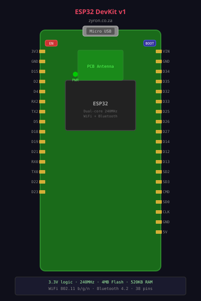
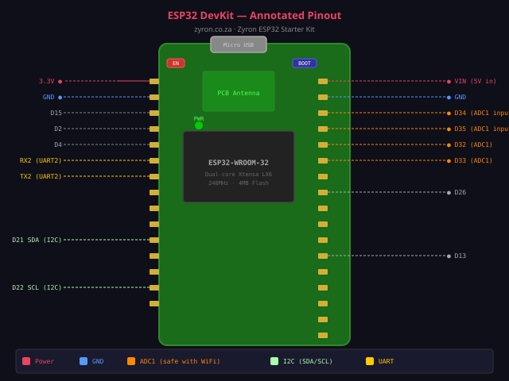

# Lesson 01 — Meet the ESP32

> **Zyron ESP32 Starter Kit Course** | [zyron.co.za](https://zyron.co.za)

---

## What Is the ESP32?

The **ESP32** is a small, powerful microcontroller chip made by **Espressif Systems** (China). Think of it as a tiny computer that can:

- Read sensors (temperature, distance, light, motion)
- Control outputs (LEDs, motors, relays, displays)
- Connect to **WiFi** and **Bluetooth** wirelessly
- Run your own custom code 24/7

It's used in thousands of real products — smart home devices, weather stations, industrial monitors, alarm systems — and you can build all of those with the kit in your hands right now.


*ESP32 DevKit v1 — the main board in your kit*

---

## Why the ESP32 (Not an Arduino Uno)?

| Feature | Arduino Uno | ESP32 |
|---|---|---|
| CPU Speed | 16 MHz | 240 MHz (15× faster) |
| RAM | 2 KB | 520 KB (260× more) |
| Storage (Flash) | 32 KB | 4 MB |
| WiFi | ✗ None | ✓ Built-in 802.11 b/g/n |
| Bluetooth | ✗ None | ✓ BLE + Classic |
| Analog inputs | 6 (10-bit) | 18 (12-bit, higher resolution) |
| Price | ~$5 | ~$4–8 |

The ESP32 is strictly more capable than the Uno for IoT work. The only reason to still use an Uno is for very simple beginner projects or when you need specific shields.

---

## The ESP32 DevKit v1 Board

Your kit includes an **ESP32 DevKit v1** — a development board that puts the ESP32 chip on a convenient PCB with:

- USB-to-Serial chip (lets your PC talk to the ESP32)
- Voltage regulator (converts 5V USB to 3.3V for the chip)
- Reset button (EN)
- Boot button (BOOT/IO0)
- Two rows of pins along the sides
- Power and status LEDs

```
     ┌──────────────────────────────┐
     │  ┌────────────────────────┐  │
     │  │                        │  │
USB ─┤  │    ESP32 chip (QFN)    │  ├─ Antenna
     │  │                        │  │
     │  └────────────────────────┘  │
     │  [EN]  [BOOT]    [LED]       │
     │                              │
     │  ● ● ● ● ● ● ● ● ● ● ● ●   │  ← Left pins
     │  ● ● ● ● ● ● ● ● ● ● ● ●   │  ← Right pins
     └──────────────────────────────┘
```


*Key areas of the DevKit v1 board*

---

## Board Layout: What Each Area Does

### The Buttons

| Button | Label | What It Does |
|---|---|---|
| Reset | **EN** | Restarts the ESP32 (like a reboot) |
| Boot | **BOOT** or **IO0** | Hold while pressing Upload to enter download mode |

You only need to use the BOOT button if uploads fail. Most of the time, uploading works automatically.

### The USB Port

Your board uses **Micro-USB** (the older, smaller connector). This does two things:
1. Powers the ESP32 from your computer
2. Transfers your code (sketch) to the board

### The Antenna

The small copper zigzag pattern (or stub antenna) on the end of the board is the **WiFi and Bluetooth antenna**. Keep it away from metal objects and the edge of your hand — metal nearby weakens the signal.

### The Voltage Regulator

The ESP32 chip runs at **3.3V**, but USB provides **5V**. A small AMS1117 regulator on the board converts 5V → 3.3V automatically. This also means:

- The **3V3 pin** on the board gives you 3.3V for sensors
- The **VIN pin** gives you the raw USB 5V (useful for the HC-SR04 and relays)
- **Never** connect 5V directly to a GPIO input pin

---

## GPIO Pins — The ESP32's Hands

**GPIO** stands for *General Purpose Input/Output*. These are the numbered pins along the two edges of the board. Each one can be:

- An **output**: drive it HIGH (3.3V) or LOW (0V) to power LEDs, buzzers, relays
- An **input**: read whether something is connected HIGH or LOW (buttons, sensor signals)
- An **analog input** (ADC): read a voltage between 0 and 3.3V (LDR, potentiometer)
- A **PWM output**: generate a varying signal for LED dimming, servo control, buzzer tones

### Full Pin Map (38-pin DevKit)

```
                      ┌──── USB ────┐
               3.3V  1│             │38  GND
                GND  2│             │37  IO23
                IO15 3│    ESP32    │36  IO22  ← I2C SCL (OLED)
                IO2  4│  DevKit v1  │35  IO1   (TX)
                IO4  5│             │34  IO3   (RX)
                IO5  6│             │33  IO21  ← I2C SDA (OLED)
               IO18  7│             │32  IO19
               IO19  8│             │31  IO18
               IO21  9│             │30  IO5
               IO22 10│             │29  IO17
               IO23 11│             │28  IO16
               IO25 12│             │27  IO4
               IO26 13│             │26  IO0   (BOOT)
               IO27 14│             │25  IO2   ← Built-in LED
               IO14 15│             │24  IO15
               IO12 16│             │23  IO8*
                GND 17│             │22  IO7*
               IO13 18│             │21  IO6*
                SD2 19│             │20  SD3
                SD1 20│             │19  SD0
                CLK 21│             │18  CMD
               GND  22│             │17  VIN   ← 5V from USB
                     └─────────────┘

* IO6, IO7, IO8 = internal flash — never use these
```

### Pins to Avoid

| Pins | Reason |
|---|---|
| GPIO 6, 7, 8, 9, 10, 11 | Connected to internal flash memory — using them crashes the ESP32 |
| GPIO 34, 35, 36, 39 | **Input only** — cannot be used as outputs |
| GPIO 0 | Boot mode pin — avoid as output (used for programming) |

### Best Pins for Each Purpose

| Purpose | Recommended GPIO |
|---|---|
| Digital output (LED, relay, buzzer) | 2, 4, 5, 13, 14, 15, 18, 19, 21, 22, 23, 25, 26, 27 |
| Digital input (button, PIR) | 2, 4, 5, 13, 14, 15, 18, 19, 23, 25, 26, 27 |
| Analog input (LDR, pot) **with WiFi** | 34, 35, 36, 39 (ADC1 — always safe) |
| Analog input **without WiFi** | 25, 26, 27, 32, 33 (ADC2 — unreliable with WiFi) |
| I2C SDA | 21 (default) |
| I2C SCL | 22 (default) |
| PWM (servo, LEDC) | Any output-capable pin |

---

## How Code Runs on the ESP32

Your code (called a **sketch**) is written in **C++** with the Arduino framework. Every sketch has two required functions:

```cpp
void setup() {
    // Runs ONCE when the board powers on or resets
    // Set up pins, connect WiFi, initialise sensors
}

void loop() {
    // Runs REPEATEDLY, forever, after setup() finishes
    // Read sensors, update displays, check conditions
}
```

The ESP32 runs your `loop()` function thousands of times per second. Each call is one iteration — read sensors, make decisions, control outputs.

### Execution flow

```
Power on / Reset
       │
       ▼
   setup()        ← runs once
       │
       ▼
┌──► loop()  ──┐  ← runs forever
└──────────────┘
```

---

## Before You Wire: The Breadboard

Every circuit in this course is built on a **breadboard** — a reusable prototyping board that makes connections without soldering. If you have not used one before, read [Lesson 02b — How to Use a Breadboard](02b_breadboard.md) before touching any wires. It covers:

- How the internal connection rows and power rails work
- Why the centre gap is there
- How to wire an LED with a resistor — the pattern every other circuit follows

---

## Your First Sketch: Blink

The equivalent of "Hello, World!" in hardware — blink the built-in LED on GPIO 2.

```cpp
void setup() {
    pinMode(2, OUTPUT);  // Tell the ESP32: GPIO 2 is an output
}

void loop() {
    digitalWrite(2, HIGH);  // Turn LED on (3.3V)
    delay(1000);             // Wait 1 second
    digitalWrite(2, LOW);   // Turn LED off (0V)
    delay(1000);             // Wait 1 second
}
```

Open [examples/01_blink/01_blink.ino](../../examples/01_blink/01_blink.ino) and flash it to your board.

---

## Key Vocabulary

| Term | Meaning |
|---|---|
| **GPIO** | General Purpose Input/Output — a pin you can control or read |
| **3.3V / VIN** | Power supply pins on the board |
| **GND** | Ground — the reference voltage (0V) for all circuits |
| **ADC** | Analogue-to-Digital Converter — reads voltage levels (0–3.3V) |
| **PWM** | Pulse Width Modulation — simulates analog output by switching fast |
| **I2C** | A 2-wire communication protocol (SCL + SDA) used by the OLED and some sensors |
| **UART** | Serial communication — used by USB to talk to your PC |
| **Flash** | The ESP32's permanent storage where your sketch lives |
| **SRAM** | The ESP32's working memory for variables while running |

---

## Next Lesson

➡️ [Lesson 02 — Your Kit Components](02_kit_components.md)

---

*[← Back to Course Index](README.md)*
