# Lesson 02 — Your Kit Components

> **Zyron ESP32 Starter Kit Course** | [zyron.co.za](https://zyron.co.za)

This lesson introduces every component in your kit — what it looks like, what it does, and which example projects use it. Think of this as your kit's visual reference guide.

---

## 1. ESP32 DevKit v1

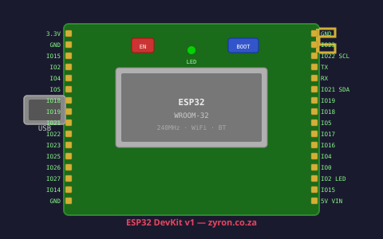

**What it is:** The brain of everything. A development board containing the ESP32 microcontroller chip, USB interface, voltage regulator, and two rows of GPIO pins.

**Identifying features:**
- Small PCB (~5 cm × 2.8 cm)
- Micro-USB port on one end
- Copper antenna pattern on the same end
- Two rows of pins along the long edges
- Small silver ESP32 module in the centre

**Used in:** All 20 examples

---

## 2. DHT22 Temperature & Humidity Sensor


**What it is:** A digital sensor that measures both temperature (−40°C to +80°C) and relative humidity (0–100%) with good accuracy.

**Identifying features:**
- Small white or blue plastic housing
- Mesh grill on the front (allows air through)
- 3 or 4 pins on the bottom
- Often labelled "AM2302" or "DHT22"

**Module vs bare sensor:**
Some kits include a bare 4-pin sensor; others include it on a small PCB module with a built-in pull-up resistor. The module is easier to wire — only 3 wires needed (VCC, GND, DATA).

```
  Bare sensor          PCB module
  ┌─────────┐          ┌──────────┐
  │  :::    │          │  :::     │
  │  DHT22  │          │  DHT22   │
  └──┬┬┬┬──┘          └───┬┬┬───┘
     ||||                  |||
  VCC|GND                VCC GND DATA
     | DATA
     └ (NC — not connected)
```

**Used in:** Examples 03, 08, 11, 12, 13, 16, 17, 18, 19, 20

---

## 3. HC-SR04 Ultrasonic Distance Sensor


**What it is:** Measures the distance to the nearest object in front of it using ultrasonic sound pulses — like sonar or bat echolocation. Range: 2 cm to 400 cm.

**Identifying features:**
- Rectangular PCB, usually blue or green
- **Two silver cylinders** on the front — one transmits, one receives
- 4 pins labelled VCC, TRIG, ECHO, GND
- Often has "HC-SR04" printed on the board

```
  Front view:

  ┌──────────────────────┐
  │   ┌───┐   ┌───┐      │
  │   │ T │   │ R │      │  ← T=Transmit  R=Receive
  │   └───┘   └───┘      │
  │  HC-SR04             │
  └──────────────────────┘
       │   │   │   │
      VCC TRIG ECHO GND
```

⚠️ **Important:** The ECHO pin outputs **5V**, which can damage the ESP32's 3.3V GPIO. Always use a voltage divider on ECHO. See [Lesson 04](04_hcsr04_sensor.md).

**Used in:** Examples 04, 08, 11, 12, 13

---

## 4. HC-SR501 PIR Motion Sensor

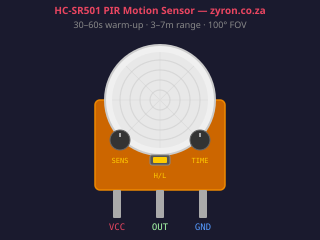

**What it is:** Detects movement by sensing changes in infrared (heat) radiation — the same technology used in security lights and alarm systems. Triggers when a warm body (person, animal) moves into range.

**Identifying features:**
- White dome (Fresnel lens) on top
- Orange/red PCB visible from below the dome
- 3 pins: VCC, OUT, GND
- Two small potentiometers on the PCB (sensitivity and time delay)
- Jumper on the PCB (trigger mode)

```
    Top view:          Side view:

    ┌────────┐         ┌─────────┐
    │  ( ⬤ ) │         │  dome   │
    │  dome  │         ├─────────┤
    └────────┘         │   PCB   │
                       └──┬┬┬───┘
                          |||
                        VCC OUT GND
```

**Onboard controls:**
```
  ┌──────────────────────────────┐
  │   ┌──┐   ┌──┐               │
  │   │S1│   │S2│    [JUMPER]   │
  │   └──┘   └──┘               │
  │   Sens   Time               │
  └──────────────────────────────┘

  S1 (left pot):  Sensitivity — clockwise = more range (up to ~7m)
  S2 (right pot): Time delay  — clockwise = longer trigger time (1–300s)
  Jumper:  H = repeatable trigger (recommended)
           L = single-shot trigger
```

**Used in:** Examples 05, 11, 12, 13, 16, 19

---

## 5. LDR — Light Dependent Resistor

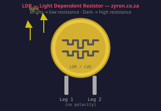

**What it is:** A resistor whose resistance changes with light level — bright light = low resistance, darkness = very high resistance. Used to detect day/night or measure ambient light.

**Identifying features:**
- Small component, looks like a tiny disc or oval (~5–10 mm)
- Characteristic squiggly pattern visible on the surface (the photosensitive element)
- Two legs (no polarity — can be inserted either way)
- Often pale yellow, orange, or clear

```
  ┌────────────┐
  │   ______   │  ← photosensitive face
  │  /______\  │
  │  \______/  │
  └──┬──────┬──┘
     │      │
   Leg 1  Leg 2   (no polarity)
```

**How to use:** Always wired as part of a **voltage divider** — one fixed resistor + the LDR — so the ESP32 can read the light level as a voltage.

**Used in:** Examples 06, 19, 20

---

## 6. SSD1306 OLED Display (0.96 inch)

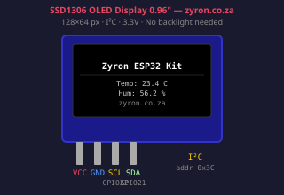

**What it is:** A tiny, crisp display that shows text, numbers, and graphics. 128×64 pixels of pure white on black. No backlight needed — each pixel generates its own light (OLED = Organic Light-Emitting Diode).

**Identifying features:**
- Very thin (~1 mm) display area
- 0.96 inch diagonal screen
- 4 pins: VCC, GND, SCL, SDA
- Communicates via I2C (only 2 data wires)
- PCB usually blue or black with yellow/blue or white display

```
  ┌────────────────────────┐
  │ ██████████████████████ │
  │ ██  OLED Display  ████ │
  │ ██  128 x 64 px   ████ │
  │ ██████████████████████ │
  └──┬──┬──┬──┬────────────┘
    VCC GND SCL SDA
```

**I2C address:** Usually `0x3C`. Some modules use `0x3D`. If your display shows nothing, try changing the address in the sketch.

**Used in:** Examples 08, 15, 20

---

## 7. 5V Relay Module

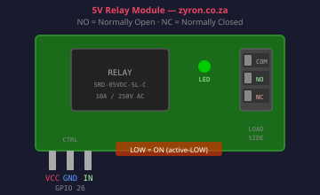

**What it is:** An electrically controlled switch. The ESP32 sends a small signal to the relay, which physically clicks and connects (or disconnects) a circuit carrying much higher current — like switching a lamp, fan, or pump.

**Identifying features:**
- Small PCB with a large black rectangular component (the relay itself)
- 3 screw terminals on one end (for the load circuit)
- 3 control pins on the other end: VCC, GND, IN
- An LED that lights up when the relay is active
- Often labelled "5V Relay" or "SRD-05VDC-SL-C"

```
                        Load side (screw terminals)
  ┌──────────────────────────────────┐
  │  ┌────────────┐     │COM│NO │NC │
  │  │   RELAY    │     └───┴───┴───┘
  │  │            │        ↑   ↑
  │  └────────────┘       NO  NC (see below)
  │  LED                              │
  └──┬──┬──┬────────────────────────┘
    VCC GND IN
    (control side)
```

**Load terminals:**
| Terminal | Meaning | State when relay activates |
|---|---|---|
| **COM** | Common — one side of your load circuit | Always connected |
| **NO** | Normally Open — disconnected at rest | **Connects** to COM |
| **NC** | Normally Closed — connected at rest | **Disconnects** from COM |

⚠️ If switching 230V AC mains, only do so if you are qualified. For learning, use 5–12V DC loads.

**Used in:** Examples 06, 09, 19

---

## 8. SG90 Servo Motor

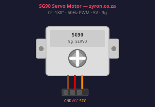

**What it is:** A small motor that rotates to a precise angle (0°–180°) on command. Used in robotics, camera pan/tilt, smart locks, and anything needing controlled rotation.

**Identifying features:**
- Small plastic gearbox housing (~23 mm × 12 mm × 29 mm)
- White output shaft/horn on top
- 3-wire cable: Brown/Black (GND), Red (VCC), Orange/Yellow (signal)
- "SG90" or "9g servo" often printed on it

```
  ┌─────────────────┐
  │  ╔═══════════╗  │  ← output shaft
  │  ║ ─────── ─ ║  │
  │  ╚═══════════╝  │
  │    SG90  9g     │
  └────────────┬────┘
               │
          ─────┴──────
         │  │   │   │
        BRN RED ORN
        GND VCC SIG
```

**Control:** Uses a **50 Hz PWM signal**. Pulse width sets angle:
- 1 ms pulse → 0°
- 1.5 ms pulse → 90° (centre)
- 2 ms pulse → 180°

**Used in:** Example 10

---

## 9. Active Buzzer

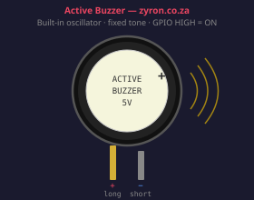

**What it is:** An electronic component that produces a beeping sound when powered. "Active" means it has an internal oscillator — just connect power and it beeps at a fixed frequency.

**Identifying features:**
- Small black or blue cylinder (~12 mm diameter, ~10 mm tall)
- Usually has a sticker on top covering the sound hole
- 2 pins: longer leg = positive (+), shorter leg = negative (−)
- Sometimes labelled with a "+" on the PCB footprint

```
    ┌──────┐
    │      │  ← small hole (sound comes out)
    │  (+) │
    └──┬───┘
       │ └── positive (longer leg / marked +)
       └──── negative (shorter leg)
```

**Active vs Passive:**
- **Active buzzer** (this kit): Has internal circuit — connect power → beeps at one fixed tone
- **Passive buzzer**: No internal circuit — you must send a PWM signal to choose the frequency (can play music)

If your buzzer doesn't respond to `ledcWriteTone()` (Example 07), you may have an active buzzer — use `digitalWrite(HIGH/LOW)` instead.

**Used in:** Examples 05, 07

---

## 10. Push Button

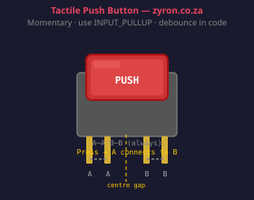

**What it is:** A momentary switch — pressing it connects two points, releasing it disconnects them. Used to trigger actions, navigate menus, or reset devices.

**Identifying features:**
- Small tactile button with a clickable cap
- 4 legs (2 pairs — each pair is internally connected)
- Fits across the centre gap of a breadboard

```
  ┌──────┐
  │  ┌─┐ │  ← press here
  │  └─┘ │
  └┬─────┬┘
   │     │  ← legs
   │     │

  Leg A ─┬─ Leg A  (internally connected)
          │
        [BTN]
          │
  Leg B ─┴─ Leg B  (internally connected)

  Pressing bridges A to B.
```

**Used in:** Example 02

---

## 11. Resistors

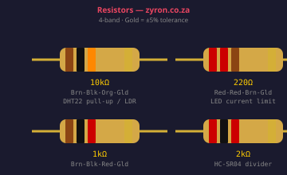

**What they are:** Components that limit current flow. Colour bands tell you the value.

| Colour Code | Typical Use in This Kit |
|---|---|
| Brown-Black-Orange (10kΩ) | DHT22 pull-up, LDR voltage divider, button pull-down |
| Brown-Black-Red (1kΩ) | LED current limiting, part of HC-SR04 voltage divider |
| Red-Red-Red (2.2kΩ) | Part of HC-SR04 voltage divider |
| Red-Red-Brown (220Ω) | LED current limiting |

**Reading a 4-band resistor:**
```
   Band 1  Band 2  Multiplier  Tolerance
     │       │         │           │
  ───┼───────┼─────────┼───────────┼───
  brown  black    orange   gold
    1      0      ×1000   ±5%

  = 10 × 1000 = 10,000Ω = 10kΩ
```

**Used in:** Most wiring circuits

---

## 12. Breadboard

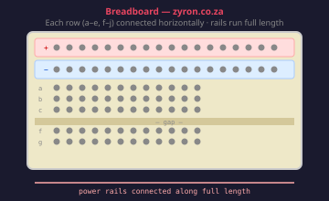

**What it is:** A plastic board with hidden internal connections for building circuits without soldering. Insert components and wires into the holes and they connect electrically. No soldering — pull things out and rearrange any time.

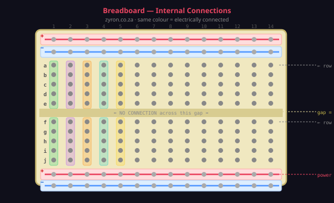

**Key rules:**

| Area | What's connected |
|---|---|
| `+` power rail | All holes in that strip run the full length — one voltage source powers everything |
| `−` power rail | Same — all holes = GND |
| Rows `a`–`e` (top half) | Each column is connected vertically — `a5`, `b5`, `c5`, `d5`, `e5` are all one node |
| Rows `f`–`j` (bottom half) | Same rule, completely independent of `a`–`e` |
| Centre gap | **No connection** — this gap separates the two halves |

> **Full walkthrough with a hands-on LED example:** [Lesson 02b — How to Use a Breadboard](02b_breadboard.md)

---

## 13. Jumper Wires

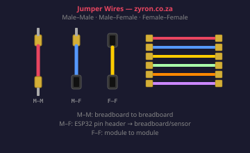

**What they are:** Pre-cut wires with connectors on each end for making connections on breadboards and to the ESP32 pins. Come in three types:

| Type | Connectors | Used for |
|---|---|---|
| **Male–Male** | Pin → Pin | Breadboard to breadboard |
| **Male–Female** | Pin → Socket | ESP32 GPIO → breadboard or sensor |
| **Female–Female** | Socket → Socket | Module to module |

Most sensors in your kit will use **Male–Female** wires to connect from the ESP32 pin header to a breadboard or directly to the sensor module.

---

## Component Quick Reference

| Component | Voltage | Digital/Analog | Lesson |
|---|---|---|---|
| ESP32 DevKit | 3.3V logic / 5V USB | Both | [01](01_meet_the_esp32.md) |
| DHT22 | 3.3V | Digital (1-wire) | [03](03_dht22_sensor.md) |
| HC-SR04 | 5V supply / 5V ECHO ⚠️ | Digital (pulse) | [04](04_hcsr04_sensor.md) |
| HC-SR501 PIR | 5V | Digital (HIGH/LOW) | [05](05_pir_sensor.md) |
| LDR | 3.3V | Analog | [06](06_ldr_sensor.md) |
| OLED SSD1306 | 3.3V | I2C digital | [07](07_oled_display.md) |
| Relay module | 5V coil | Digital control | [08](08_relay_module.md) |
| SG90 Servo | 5V | PWM | [09](09_servo_motor.md) |
| Active Buzzer | 3.3V or 5V | Digital / PWM | [10](10_buzzer_button.md) |
| Push Button | — | Digital | [10](10_buzzer_button.md) |

---

## Next Lesson

➡️ [Lesson 03 — DHT22 Temperature & Humidity Sensor](03_dht22_sensor.md)

---

*[← Back to Course Index](README.md)*
