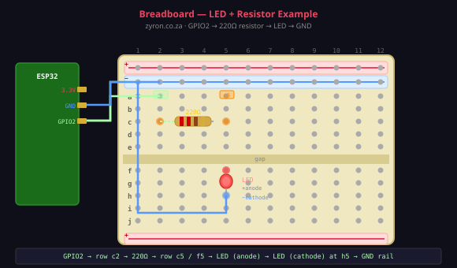

# Lesson 02b — How to Use a Breadboard

> **Zyron ESP32 Starter Kit Course** | [zyron.co.za](https://zyron.co.za)

---

Every circuit in this course is built on a **breadboard**. Before connecting a single wire, make sure you understand how this tool works — it will save you hours of debugging.

---

## What Is a Breadboard?

A breadboard is a plastic board full of small spring-loaded holes called **tie points**. Push a wire or component leg into a hole and it makes an electrical contact — no soldering needed. You can rearrange and reuse it as many times as you like.


---

## The Internal Connections — This Is Everything

The breadboard looks like a grid of holes. What matters is how those holes are connected **underneath the plastic**.

### Power Rails (the long strips on each edge)

The two rows running the **full length** on each side are the **power rails**:

| Rail | Label | Colour | Purpose |
|---|---|---|---|
| Positive | **+** | Red stripe | Connect to 3.3V or 5V |
| Negative | **−** | Blue stripe | Connect to GND |

Every hole in a `+` rail is connected to every other hole in that same rail. The same for `−`. This means you only need **one** wire from the ESP32 to power an entire row of components.

> Most breadboards have a **break in the middle** of each power rail. If your circuit spans across this break, bridge it with a short wire.

### Tie-Point Rows (the main grid)

The main area in the middle is divided into two halves by a **centre gap**:

- **Top half:** rows labelled `a` → `e`
- **Bottom half:** rows labelled `f` → `j`

**The rule:**

> Every hole in the same **column + half** is connected together. Columns are **not** connected to each other, and the two halves **are not** connected across the gap.

So if a component leg sits in `e5`, it is automatically connected to `a5`, `b5`, `c5` and `d5`. But **not** to `f5` (that is on the other side of the gap).

```
   col:   1    2    3    4    5    6
         ───  ───  ───  ───  ───  ───
 row a │  ○    ○    ○    ○  [●]   ○    ← all 5 holes in col 5, rows a–e
 row b │  ○    ○    ○    ○  [●]   ○       are connected together
 row c │  ○    ○    ○    ○  [●]   ○
 row d │  ○    ○    ○    ○  [●]   ○
 row e │  ○    ○    ○    ○  [●]   ○
         ════════ GAP ════════════       ← NO connection across here
 row f │  ○    ○    ○    ○   ○    ○    ← col 5 rows f–j are a separate group
 row g │  ○    ○    ○    ○   ○    ○
 row h │  ○    ○    ○    ○   ○    ○
 row i │  ○    ○    ○    ○   ○    ○
 row j │  ○    ○    ○    ○   ○    ○
```

### Why Is There a Gap?

Integrated circuits (ICs) and chips straddle the gap. Each leg of the chip sits in one half and is isolated from the other — so you can wire each leg independently. For simple components like resistors and LEDs in this kit, you will use the gap to **break a circuit in two**.

---

## Your First Breadboard Circuit — LED with Resistor

Let's wire up an LED to the ESP32 on a breadboard. This teaches the fundamental pattern used in every project.



### Components needed

| Component | Quantity |
|---|---|
| ESP32 DevKit | 1 |
| Red LED | 1 |
| 220 Ω resistor | 1 |
| Jumper wire (M–F) | 2 |
| Breadboard | 1 |

### Step-by-step

**1. Power the breadboard rails**

| Wire colour | From | To | Purpose |
|---|---|---|---|
| Red | ESP32 `3.3V` | Breadboard `+` rail | 3.3V power |
| Black / blue | ESP32 `GND` | Breadboard `−` rail | Ground |

**2. Place the resistor**

Insert the resistor horizontally across the **centre gap**:
- One leg in `c3` (top half)
- Other leg in `f3` (bottom half)

This bridges the gap and puts both legs on the same column but on opposite sides, so you can reach them independently.

**3. Connect the GPIO wire**

Run a jumper from **ESP32 GPIO2** to **`c3`** (same row/column as the resistor). Now the resistor's left leg is connected to GPIO2.

**4. Place the LED**

LEDs have a **polarity** — they only work one way:

| LED leg | Identifier | Insert |
|---|---|---|
| **Anode** (+, longer) | Connects to current | `g3` |
| **Cathode** (−, shorter, flat side) | Connects to GND | `g4` |

So the anode (`g3`) is in the same column as the resistor's right leg (`f3`) — they are connected.

**5. Connect the cathode to GND**

Run a jumper from **`g4`** (LED cathode) to the **`−` rail**. The GND rail connects back to the ESP32's GND.

**6. Control it with code**

```cpp
void setup() {
    pinMode(2, OUTPUT);
}

void loop() {
    digitalWrite(2, HIGH);   // LED on
    delay(500);
    digitalWrite(2, LOW);    // LED off
    delay(500);
}
```

---

## Why Do We Need the 220 Ω Resistor?

An LED without a resistor will draw too much current and **burn out** — sometimes within seconds.

The resistor limits how much current flows through the LED to a safe value.

| Supply | LED forward voltage | Resistor formula |
|---|---|---|
| 3.3V | ~2.0V (red) | (3.3 − 2.0) / 0.015 A = **87 Ω minimum** |

Use 220 Ω for a safe margin. Lower = brighter, but check the LED's datasheet. Anything from **100 Ω to 470 Ω** works fine for a status LED.

---

## Common Breadboard Mistakes

| Mistake | Symptom | Fix |
|---|---|---|
| Wire plugged in wrong column | Nothing works | Count the columns carefully |
| LED inserted backwards | LED doesn't light | Swap the LED — try both ways |
| Resistor wrong value | LED very dim or burned | Check the colour bands |
| Power rail break not bridged | Only half the rail has power | Add a short wire across the break |
| Using the same column on opposite sides of the gap | Unexpected short circuit | Remember: rows a–e and f–j are separate |
| Multiple components on the same row, same half | Unintended connection | Move one component to a different column |

---

## Power Rail Tips

```
  ┌──── + red  ════════════════════════╗   ← all these holes = 3.3V
  │     − blue ════════════════════════╣   ← all these holes = GND
  │                                    ║
  │   a  b  c  d  e    f  g  h  i  j  ║
  │1  ○  ○  ○  ○  ○  ║  ○  ○  ○  ○  ○ ║   each numbered column
  │2  ○  ○  ○  ○  ○  ║  ○  ○  ○  ○  ○ ║   is independent
  │3  ○  ○  ○  ○  ○  ║  ○  ○  ○  ○  ○ ║
  │                                    ║
  └──── + red  ════════════════════════╝   ← second set of rails (bottom)
        − blue ══════════════════════════
```

Connect **power rails to the ESP32 once** at the start of your build. Then every component can tap power from the nearest rail hole instead of running individual wires all the way back to the ESP32.

---

## Summary

| Rule | Detail |
|---|---|
| **Rows a–e** | Each column connected vertically within that half |
| **Rows f–j** | Same rule, independent of a–e |
| **Gap** | No connection between a–e and f–j |
| **Power rails (+/−)** | Connected along full length (check for mid-rail break) |
| **LED polarity** | Longer leg = anode (+) → toward resistor / power |
| **Always use a resistor** | With every LED, every time |

---

## Next Steps

➡️ [Lesson 03 — DHT22 Temperature & Humidity Sensor](03_dht22_sensor.md)

---

*[← Back to Course Index](README.md)*
