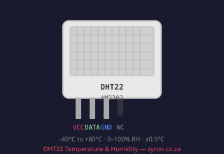
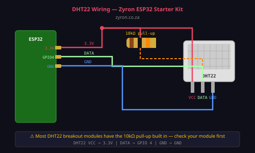

# Lesson 03 — DHT22 Temperature & Humidity Sensor

> **Zyron ESP32 Starter Kit Course** | [zyron.co.za](https://zyron.co.za)

---

## What Is the DHT22?

The **DHT22** (also called AM2302) is a digital sensor that measures:

- **Temperature:** −40°C to +80°C, ±0.5°C accuracy
- **Relative humidity:** 0–100%, ±2–5% accuracy

"Digital" means it sends data as a coded signal — not a raw voltage. You need the Adafruit DHT library to decode it. The sensor reads once every 2 seconds maximum.


*DHT22 sensor — white housing with mesh grill*

---

## How It Works

Inside the DHT22 is a **capacitive humidity sensor** and a **thermistor** (temperature-sensitive resistor). A small built-in chip reads both sensors, converts the readings to digital data, and sends them out on a single DATA pin using a proprietary 1-wire protocol.

```
                    ┌──────────────┐
  ESP32 GPIO 4  ────┤ DATA         │
                    │              │
  3.3V          ────┤ VCC    DHT22 │
  GND           ────┤ GND          │
                    └──────────────┘

  The single DATA line carries both temperature and humidity.
```

When you call `dht.readTemperature()`, the library:
1. Pulls the DATA line LOW for ~1 ms (wake-up signal)
2. Releases it HIGH
3. The DHT22 responds with 40 bits of data (humidity + temperature + checksum)
4. The library decodes the bits and returns a float

---

## Wiring



```
DHT22 / Module       ESP32 DevKit
─────────────────────────────────
  VCC           →    3.3V
  GND           →    GND
  DATA          →    GPIO 4

  + 10kΩ pull-up resistor between DATA and 3.3V
  (most breakout modules have this built in — check your module)
```

**Breadboard layout:**
```
  3.3V ───┬──── VCC (DHT22)
          │
        [10kΩ]
          │
          └──── DATA (DHT22) ──── GPIO 4
  GND  ───────── GND (DHT22)
```

**Why the pull-up resistor?**
The DATA line is an "open-drain" output — the sensor can only pull it LOW, not HIGH. The resistor pulls it HIGH by default. Without it, the line floats and readings are random or nan.

---

## Example Code

Open [examples/03_dht22_monitor/03_dht22_monitor.ino](../../examples/03_dht22_monitor/03_dht22_monitor.ino)

```cpp
#include <DHT.h>

DHT dht(4, DHT22);  // Pin 4, DHT22 type

void setup() {
    Serial.begin(115200);
    dht.begin();
    delay(2000);  // Let sensor stabilise
}

void loop() {
    float humidity = dht.readHumidity();
    float tempC    = dht.readTemperature();

    if (isnan(humidity) || isnan(tempC)) {
        Serial.println("Read failed — check wiring!");
        delay(2000);
        return;
    }

    Serial.printf("Temp: %.1f°C   Humidity: %.1f%%\n", tempC, humidity);
    delay(2000);  // DHT22 needs minimum 2 seconds between reads
}
```

**What you should see in Serial Monitor (115200 baud):**
```
Temp: 23.4°C   Humidity: 56.2%
Temp: 23.5°C   Humidity: 56.1%
```

---

## Reading Heat Index

Heat index is how hot it "feels" — accounting for humidity. The library calculates it:

```cpp
float heatIndex = dht.computeHeatIndex(tempC, humidity, false); // false = Celsius
```

When humidity is high, even a moderate temperature feels much hotter. A 30°C room at 90% humidity feels like ~38°C.

---

## DHT11 vs DHT22

Your kit may include either. Here's how to tell the difference:

| Feature | DHT11 | DHT22 |
|---|---|---|
| Colour | Usually **blue** | Usually **white** |
| Temperature range | 0–50°C | −40 to +80°C |
| Humidity range | 20–90% | 0–100% |
| Accuracy | ±2°C / ±5% RH | ±0.5°C / ±2% RH |
| Read interval | 1 second | 2 seconds |
| Price | Cheaper | More expensive |

If you have a DHT11, change the sketch to:
```cpp
DHT dht(4, DHT11);  // Change DHT22 → DHT11
```

---

## Troubleshooting

| Symptom | Cause | Fix |
|---|---|---|
| Output shows `nan` | Missing pull-up resistor | Add 10kΩ between DATA and 3.3V |
| Output shows `nan` | Wrong pin number | Check `DHT_PIN` matches your wiring |
| Output shows `nan` | Reads too fast | Add `delay(2000)` between reads |
| Stuck on first value | Sensor not warmed up | Add `delay(2000)` in `setup()` |
| Humidity always 0% | DHT11 but sketch set to DHT22 | Change sensor type in code |
| Temperature wildly wrong | Sensor near heat source | Move sensor away from CPU, relay, power supply |

---

## Where to Use It in Real Projects

- Indoor climate monitoring
- Server room temperature alert
- Greenhouse humidity control
- Baby room comfort monitor
- Weather station

---

## Next Lesson

➡️ [Lesson 04 — HC-SR04 Ultrasonic Distance Sensor](04_hcsr04_sensor.md)

*[← Back to Course Index](README.md)*
