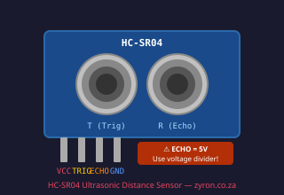
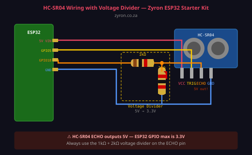

# Lesson 04 — HC-SR04 Ultrasonic Distance Sensor

> **Zyron ESP32 Starter Kit Course** | [zyron.co.za](https://zyron.co.za)

---

## What Is the HC-SR04?

The **HC-SR04** is an ultrasonic distance sensor — it measures how far away an object is by bouncing sound waves off it, like sonar or a bat.

- **Range:** 2 cm – 400 cm
- **Accuracy:** ±3 mm
- **Beam angle:** ~15° cone


*HC-SR04 — the two silver cylinders are the transmitter (T) and receiver (R)*

---

## How It Works: Sound Timing

```
  ESP32          HC-SR04              Object
    │                │                   │
    │──TRIG HIGH──►  │                   │
    │  (10 µs)       │──── sound ──────► │
    │                │                   │
    │◄──ECHO HIGH──  │ ◄──── echo ────── │
    │  (duration)    │                   │
    │                │                   │

  Distance = (echo duration × speed of sound) ÷ 2
```

1. You pulse the **TRIG** pin HIGH for 10 microseconds
2. The sensor sends 8 ultrasonic pulses at **40 kHz** (inaudible to humans)
3. When the echo returns, the **ECHO** pin goes HIGH
4. The duration ECHO stays HIGH = time for sound to travel to object and back
5. Distance = duration × 0.034 cm/µs ÷ 2

**Why divide by 2?** Because the sound travels to the object AND back — you only want one way.

---

## ⚠️ Critical Safety: The 5V ECHO Pin

> **This is the most important thing about the HC-SR04.**

The HC-SR04 needs **5V to power** it, and its ECHO pin also outputs **5V logic**.

The ESP32's GPIO pins are rated for a maximum of **3.3V**.

Connecting a 5V signal directly to an ESP32 GPIO will **damage the chip** over time.

**You must use a voltage divider on the ECHO pin:**

```
HC-SR04 ECHO (5V)
         │
       [1kΩ]
         │
         └───── GPIO 18 (3.3V safe)
         │
       [2kΩ]
         │
        GND

Result: 5V × 2kΩ/(1kΩ+2kΩ) = 3.33V ✓
```

The TRIG pin is fine without a divider — the HC-SR04 accepts 3.3V logic on TRIG.

---

## Wiring



```
HC-SR04          ESP32 DevKit
─────────────────────────────────────────────
  VCC    →   5V (VIN pin)
  GND    →   GND
  TRIG   →   GPIO 5          (direct, no divider needed)
  ECHO   →   GPIO 18         (via voltage divider — see above)
```

**Breadboard layout:**
```
  VIN (5V) ──────────────── VCC (HC-SR04)
  GND      ──────────────── GND (HC-SR04)
  GPIO 5   ──────────────── TRIG

                [1kΩ]
  ECHO ────┬────────────── GPIO 18
           │
          [2kΩ]
           │
          GND
```

---

## Example Code

Open [examples/04_ultrasonic_distance/04_ultrasonic_distance.ino](../../examples/04_ultrasonic_distance/04_ultrasonic_distance.ino)

```cpp
#define TRIG_PIN 5
#define ECHO_PIN 18

void setup() {
    Serial.begin(115200);
    pinMode(TRIG_PIN, OUTPUT);
    pinMode(ECHO_PIN, INPUT);
}

float measureDistanceCm() {
    // Send trigger pulse
    digitalWrite(TRIG_PIN, LOW);
    delayMicroseconds(2);
    digitalWrite(TRIG_PIN, HIGH);
    delayMicroseconds(10);
    digitalWrite(TRIG_PIN, LOW);

    // Measure echo duration (timeout = 30 ms ≈ 5 m)
    long duration = pulseIn(ECHO_PIN, HIGH, 30000UL);
    if (duration == 0) return -1; // out of range

    return duration * 0.034 / 2.0;
}

void loop() {
    float dist = measureDistanceCm();
    if (dist < 0) {
        Serial.println("Out of range");
    } else {
        Serial.printf("Distance: %.1f cm\n", dist);
    }
    delay(500);
}
```

---

## Measurement Accuracy Tips

| Situation | Effect | Solution |
|---|---|---|
| Object at an angle | Sound scatters — no echo | Point sensor perpendicular to object |
| Soft/furry surface | Absorbs sound | Works less well; expect shorter detected range |
| Object < 2 cm | Below minimum range | Add a minimum distance check |
| Object > 4 m | Too far — no return | Check for `-1` return value |
| Multiple sensors firing at once | Crosstalk | Stagger trigger timing |

---

## Real-World Uses

- **Parking sensor** — alert when a car is too close
- **Water tank level** — measure distance from sensor to water surface
- **Robot obstacle avoidance** — stop before hitting walls
- **Rubbish bin fill level** — detect when bin is full
- **Intrusion detection** — alert when object enters a zone

---

## Next Lesson

➡️ [Lesson 05 — HC-SR501 PIR Motion Sensor](05_pir_sensor.md)

*[← Back to Course Index](README.md)*
