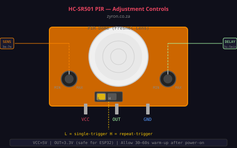
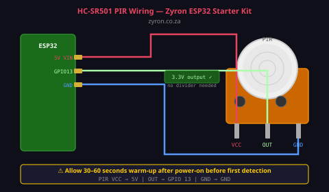

# Lesson 05 — HC-SR501 PIR Motion Sensor

> **Zyron ESP32 Starter Kit Course** | [zyron.co.za](https://zyron.co.za)

---

## What Is a PIR Sensor?

**PIR** stands for *Passive Infrared*. The sensor detects changes in infrared radiation (heat) in its field of view. Every warm object — people, animals, even warm machinery — emits infrared radiation. When something warm moves in front of the sensor, the change in radiation triggers the output.

"Passive" means the sensor doesn't emit anything — it only listens. This makes it very power-efficient.


*HC-SR501 — the white dome is a Fresnel lens that focuses infrared radiation onto the sensor*

---

## How It Works

```
  Infrared radiation from warm objects
           │
           ▼
     ┌───────────┐
     │  Fresnel  │  ← white dome/lens — focuses IR onto two sensor elements
     │   Lens    │
     └─────┬─────┘
           │
     ┌─────▼─────┐
     │  Dual     │  ← two side-by-side pyroelectric elements
     │  element  │    when a warm object moves, one element sees it before the other
     │  PIR chip │    the difference in signal triggers the output
     └─────┬─────┘
           │
     ┌─────▼─────┐
     │  Signal   │  → OUT pin goes HIGH when motion detected
     │ processor │
     └───────────┘
```

A stationary warm object does NOT trigger the PIR — only movement triggers it. This is why a person standing completely still may eventually stop triggering a PIR security light.

---

## The Onboard Controls



```
  ┌──────────────────────────────────────┐
  │                                      │
  │    ┌──────┐    ┌──────┐             │
  │    │  S1  │    │  S2  │  [JMP]      │
  │    └──────┘    └──────┘             │
  │   Sensitivity  Time Delay  Trigger   │
  │                             Mode     │
  └──────────────────────────────────────┘
```

### S1 — Sensitivity Potentiometer (left)
- Turn **clockwise** → increases detection range (up to ~7 metres)
- Turn **counter-clockwise** → decreases range (minimum ~3 metres)
- Set to middle for typical room use

### S2 — Time Delay Potentiometer (right)
- Controls how long the OUT pin stays HIGH after motion is detected
- Turn **clockwise** → longer delay (up to ~300 seconds / 5 minutes)
- Turn **counter-clockwise** → shorter delay (minimum ~1 second)
- Set to minimum for responsive projects; longer for lights that should stay on

### JMP — Trigger Mode Jumper
Two positions:

| Position | Mode | Behaviour |
|---|---|---|
| **H** | Repeatable | OUT stays HIGH as long as motion continues. Re-triggers itself. Best for most uses. |
| **L** | Single-shot | OUT pulses HIGH once, then goes LOW for the time delay period — even if motion continues |

**Recommendation:** Use **H (repeatable trigger)** for most projects.

---

## Wiring



```
HC-SR501        ESP32 DevKit
──────────────────────────────
  VCC   →   5V (VIN pin)
  GND   →   GND
  OUT   →   GPIO 13
```

The OUT pin outputs **3.3V logic** (ESP32-safe) — no voltage divider needed. This is one of the few 5V-powered sensors where the output signal is already 3.3V compatible.

---

## ⚠️ Important: Warm-Up Time

After powering on, the HC-SR501 requires **30–60 seconds to calibrate** before it will detect motion reliably. During this warm-up period:
- The OUT pin may pulse HIGH/LOW erratically — this is normal
- The sensor is mapping the "baseline" infrared level of the room

In code, add a delay in `setup()`:
```cpp
Serial.println("Waiting for PIR to calibrate (30s)...");
delay(30000);
Serial.println("Ready.");
```

---

## Example Code

Open [examples/05_pir_motion_alarm/05_pir_motion_alarm.ino](../../examples/05_pir_motion_alarm/05_pir_motion_alarm.ino)

```cpp
#define PIR_PIN 13

void setup() {
    Serial.begin(115200);
    pinMode(PIR_PIN, INPUT);
    delay(30000); // Wait for calibration
    Serial.println("Monitoring for motion...");
}

void loop() {
    if (digitalRead(PIR_PIN) == HIGH) {
        Serial.println("Motion detected!");
        delay(1000); // Simple debounce
    }
}
```

For a more robust solution, use **interrupt-driven detection** as in the full example — this catches motion even during `delay()` calls.

---

## Detection Range

```
         PIR sensor
              │
         _____|_____
        /           \
       /  detection  \
      /     zone      \
     /                 \
    /___________________\
           ~7 m max
           ~100° angle

  Optimal detection:
  - Objects moving across the field (left-right)
  - Less effective for objects moving directly toward the sensor
```

---

## Troubleshooting

| Symptom | Likely Cause | Fix |
|---|---|---|
| Never triggers | Too short warm-up | Wait full 60 seconds after power-on |
| Triggers randomly | Near heat/AC vent | Move away from heat sources |
| Triggers on room lights | Lights flicker (fluorescent) | Shield sensor from direct light |
| Won't stop triggering | Sensitivity too high | Turn S1 counter-clockwise |
| Triggers once then stops | Jumper in L mode | Move jumper to H position |
| OUT always HIGH | Faulty sensor or wiring | Swap GND/VCC, check connections |

---

## Real-World Uses

- **Security alarm** — detect intruders
- **Automatic lights** — turn on when someone enters
- **Smart doorbell** — detect approaching visitors
- **Sleep monitor** — detect if someone gets out of bed
- **Energy saving** — turn off screens or appliances when room is empty

---

## Next Lesson

➡️ [Lesson 06 — LDR Light Sensor](06_ldr_sensor.md)

*[← Back to Course Index](README.md)*
