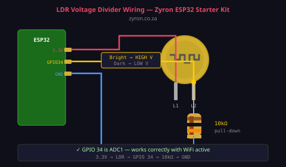

# Lesson 06 — LDR Light Sensor

> **Zyron ESP32 Starter Kit Course** | [zyron.co.za](https://zyron.co.za)

---

## What Is an LDR?

**LDR** stands for *Light Dependent Resistor* (also called a photoresistor or photocell). It's a simple two-legged component whose electrical resistance changes based on how much light hits it:

- **Bright light** → low resistance (~100Ω – 1kΩ)
- **Darkness** → high resistance (~1MΩ – 10MΩ)


*LDR — the squiggly pattern is the photosensitive semiconductor element*

---

## How It Works

The LDR is made from a semiconductor material (usually cadmium sulphide — CdS) that releases electrons when struck by photons (light). More photons = more free electrons = lower resistance.

```
  Darkness:     LDR resistance = HIGH (~1MΩ)
  Dim light:    LDR resistance = MEDIUM (~100kΩ)
  Bright light: LDR resistance = LOW (~1kΩ)

  Resistance curve (approximate):

  10MΩ ┤
       │╲
  1MΩ  ┤ ╲
       │  ╲
  100kΩ┤   ──╲
       │      ───╲
  10kΩ ┤           ────╲
       │                ────────
  1kΩ  ┤                       ─────
       └────────────────────────────
          dark        bright
```

---

## The Voltage Divider Circuit

The ESP32's ADC reads **voltage** (0–3.3V), not resistance. To convert the LDR's changing resistance into a changing voltage, you use a **voltage divider** with a fixed 10kΩ resistor:

```
  3.3V
   │
  [LDR]  ← resistance changes with light
   │
   ├────── GPIO 34 (ADC reads voltage here)
   │
  [10kΩ] ← fixed resistor
   │
  GND
```

**How it works:**

When the LDR is bright (low resistance ~1kΩ):
```
Voltage at GPIO = 3.3V × 10kΩ / (1kΩ + 10kΩ) = 3.0V  → high ADC reading
```

When the LDR is dark (high resistance ~1MΩ):
```
Voltage at GPIO = 3.3V × 10kΩ / (1MΩ + 10kΩ) = 0.033V → low ADC reading
```

So: **Bright = high ADC value, Dark = low ADC value**

---

## Wiring



```
  3.3V ───── LDR leg 1
             LDR leg 2 ───── GPIO 34
                       ───── 10kΩ resistor ───── GND

  (LDR has no polarity — either leg can go to 3.3V)
```

**Use GPIO 34 (or 35, 36, 39)** — these are ADC1 pins and work correctly even when WiFi is active. ADC2 pins (GPIO 25–27, 32, 33) give unreliable readings when WiFi is on.

---

## Example Code

Open [examples/06_ldr_night_light/06_ldr_night_light.ino](../../examples/06_ldr_night_light/06_ldr_night_light.ino)

```cpp
#define LDR_PIN 34

void setup() {
    Serial.begin(115200);
}

void loop() {
    int raw     = analogRead(LDR_PIN);       // 0–4095 (12-bit ADC)
    float volts = raw * (3.3 / 4095.0);      // convert to voltage
    int pct     = map(raw, 0, 4095, 0, 100); // 0% = dark, 100% = bright

    Serial.printf("Raw: %4d  Voltage: %.2fV  Light: %3d%%\n", raw, volts, pct);
    delay(500);
}
```

**What you should see:**
```
Cover the LDR with your hand:
Raw:  156  Voltage: 0.13V  Light:   3%

Shine a torch at the LDR:
Raw: 3841  Voltage: 3.09V  Light:  93%
```

---

## Setting a Threshold (Day/Night Detection)

To switch something ON at dark, pick a threshold value. Use the Serial Monitor to find the raw value at your room's "dusk" level, then use it in code:

```cpp
const int DARK_THRESHOLD = 1000; // Adjust this for your environment

if (raw < DARK_THRESHOLD) {
    // It's dark — turn something on
} else {
    // It's bright — turn it off
}
```

**Hysteresis** prevents rapid on/off switching near the threshold:
```cpp
const int HYSTERESIS = 50;

if (!isOn && raw < DARK_THRESHOLD - HYSTERESIS) {
    isOn = true; // Turn on
}
if (isOn && raw > DARK_THRESHOLD + HYSTERESIS) {
    isOn = false; // Turn off
}
```

---

## Calibration

Different LDRs and different lighting environments give different raw values. Before finalising your threshold, open the Serial Monitor and:

1. Note the value in complete darkness → this is your dark floor
2. Note the value in your normal ambient lighting → this is your baseline
3. Note the value in bright direct light → this is your bright ceiling
4. Set your threshold somewhere between dark floor and baseline

---

## Real-World Uses

- **Automatic night light** — turn on relay when it gets dark
- **Screen brightness control** — dim a display in a dark room
- **Street light controller** — on at dusk, off at dawn
- **Photography light meter** — measure ambient light for exposure
- **Alarm bypass** — disable motion alarm when lights are on (someone is home)

---

## Next Lesson

➡️ [Lesson 07 — SSD1306 OLED Display](07_oled_display.md)

*[← Back to Course Index](README.md)*
