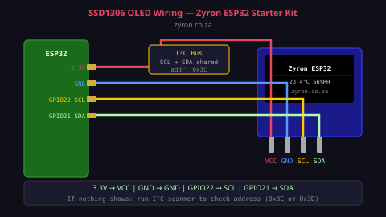

# Lesson 07 — SSD1306 OLED Display

> **Zyron ESP32 Starter Kit Course** | [zyron.co.za](https://zyron.co.za)

---

## What Is the SSD1306 OLED?

The **SSD1306** is a 0.96-inch OLED (Organic Light-Emitting Diode) display:
- **Resolution:** 128 × 64 pixels
- **Colours:** Monochrome (white pixels on black background)
- **Interface:** I2C (only 2 data wires — SCL and SDA)
- **No backlight needed** — each pixel emits its own light

OLED displays are sharper and more power-efficient than LCD screens because pixels that are OFF draw no power at all.


*0.96" SSD1306 OLED — tiny but very readable*

---

## I2C Protocol Basics

**I2C** (Inter-Integrated Circuit) is a communication protocol that lets multiple devices share just 2 wires:

| Wire | Label | Function |
|---|---|---|
| Clock | **SCL** | The ESP32 pulses this to synchronise timing |
| Data | **SDA** | Data travels back and forth on this wire |

Every I2C device has a unique **address** (usually 7 bits). Multiple devices can share the same SCL/SDA wires — each responds only to its own address.

```
  ESP32
  GPIO 22 (SCL) ────┬──── OLED SCL
  GPIO 21 (SDA) ────┼──── OLED SDA
                    │
                    ├──── Another I2C sensor SCL/SDA
                    │
                   [4.7kΩ pull-ups to 3.3V on each line]
                   (most OLED modules have these built in)
```

**Default OLED address:** `0x3C` (some modules use `0x3D` — run the I2C scanner below to check yours)

---

## Wiring



```
OLED Module       ESP32 DevKit
─────────────────────────────
  VCC   →   3.3V
  GND   →   GND
  SCL   →   GPIO 22
  SDA   →   GPIO 21
```

Pin order on the module can vary — always check the labels, not just the pin position. Some modules have GND on the left, some on the right.

---

## I2C Address Scanner

If your display shows nothing, run this sketch first to find the actual address:

```cpp
#include <Wire.h>

void setup() {
    Serial.begin(115200);
    Wire.begin();
    Serial.println("Scanning I2C bus...");
    for (byte addr = 1; addr < 127; addr++) {
        Wire.beginTransmission(addr);
        if (Wire.endTransmission() == 0) {
            Serial.printf("Device found at address 0x%02X\n", addr);
        }
    }
    Serial.println("Done.");
}

void loop() {}
```

Then update your sketch: `display.begin(SSD1306_SWITCHCAPVCC, 0x3D)` if your address is `0x3D`.

---

## Required Libraries

Install via **Tools → Manage Libraries:**
- **Adafruit SSD1306** (by Adafruit)
- **Adafruit GFX Library** (by Adafruit) — dependency

---

## Example Code

Open [examples/08_oled_sensor_display/08_oled_sensor_display.ino](../../examples/08_oled_sensor_display/08_oled_sensor_display.ino)

### Minimal "Hello World" on OLED

```cpp
#include <Wire.h>
#include <Adafruit_GFX.h>
#include <Adafruit_SSD1306.h>

Adafruit_SSD1306 display(128, 64, &Wire, -1);

void setup() {
    display.begin(SSD1306_SWITCHCAPVCC, 0x3C);
    display.clearDisplay();
    display.setTextColor(SSD1306_WHITE);
    display.setTextSize(2);
    display.setCursor(0, 20);
    display.println("Hello!");
    display.display(); // ← MUST call this to push buffer to screen
}

void loop() {}
```

### Key Display Functions

```cpp
display.clearDisplay();           // Wipe the screen buffer
display.display();                // Push buffer to physical screen (always call after drawing)

display.setTextSize(1);           // 1 = normal, 2 = double, 3 = triple size
display.setTextColor(SSD1306_WHITE); // WHITE or BLACK
display.setCursor(x, y);          // x=0-127, y=0-63 (pixels from top-left)
display.print("Hello");           // Print text at cursor
display.println("World");         // Print and move to next line
display.printf("Temp: %.1f", t);  // Formatted text

// Drawing shapes
display.drawLine(x0, y0, x1, y1, SSD1306_WHITE);
display.drawRect(x, y, width, height, SSD1306_WHITE);
display.fillRect(x, y, width, height, SSD1306_WHITE);
display.drawCircle(centreX, centreY, radius, SSD1306_WHITE);

// Inverting: swap black and white everywhere
display.invertDisplay(true);
display.invertDisplay(false);
```

---

## Screen Layout Example

```
  ┌──────────────────────────────────────────┐  row 0
  │ Temperature         Humidity             │
  │   23.4°C              56%                │  row 14
  │ Distance            Motion               │
  │   142 cm               NO                │  row 38
  │ zyron.co.za         up 342s              │  row 56
  └──────────────────────────────────────────┘  row 63
  col 0                                     col 127
```

```cpp
// 5-row layout for sensor data
display.clearDisplay();
display.setTextSize(1);
display.setCursor(0, 0);  display.print("Temp: ");    display.printf("%.1f C", tempC);
display.setCursor(0, 12); display.print("Hum:  ");    display.printf("%.1f %%", hum);
display.setCursor(0, 24); display.print("Dist: ");    display.printf("%.0f cm", dist);
display.setCursor(0, 36); display.print("Motion: ");  display.print(motion ? "YES" : "NO");
display.setCursor(0, 52); display.printf("up %lus", millis() / 1000);
display.display();
```

---

## Troubleshooting

| Symptom | Cause | Fix |
|---|---|---|
| Nothing on screen | Wrong I2C address | Run I2C scanner sketch |
| Nothing on screen | `display()` not called | Add `display.display()` after drawing |
| Garbled pixels | SDA/SCL swapped | Check wiring |
| First line only | Wrong screen height | Use 64, not 32: `Adafruit_SSD1306(128, 64, ...)` |
| Screen freezes | Program crash / loop issue | Check for infinite loops or missing `delay()` |

---

## Real-World Uses

- Show live sensor readings locally (no phone/computer needed)
- Display clock and date
- Show device status and IP address on startup
- Menu navigation for settings
- Mini weather station display

---

## Next Lesson

➡️ [Lesson 08 — Relay Module](08_relay_module.md)

*[← Back to Course Index](README.md)*
