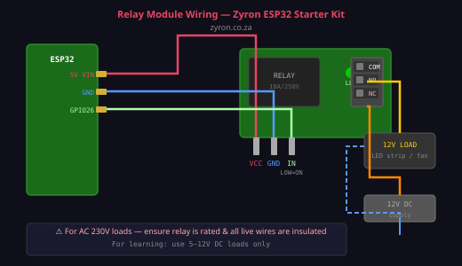

# Lesson 08 — Relay Module

> **Zyron ESP32 Starter Kit Course** | [zyron.co.za](https://zyron.co.za)

---

## What Is a Relay?

A **relay** is an electrically operated switch. A small control signal (from the ESP32) activates an electromagnet inside the relay, which physically moves a metal contact to connect or disconnect a separate, higher-power circuit.

Think of it as a remote-controlled light switch — your ESP32 flicks the switch without touching the high-voltage wiring.


*5V relay module — control pins on the left, screw terminals for the load on the right*

---

## How It Works

```
  ┌─────────────────────────────────────────┐
  │   Control side           Load side       │
  │                                          │
  │  ESP32 GPIO ──► Coil ──► Magnet         │
  │                             │            │
  │                          Contact ──► COM │──── your lamp/fan/etc
  │                             │            │
  │                            NO ──────────────── (connects when ON)
  │                            NC ──────────────── (connects when OFF)
  └─────────────────────────────────────────┘
```

1. ESP32 sends signal to relay IN pin → coil energises → magnet pulls metal arm
2. Metal arm moves → **COM** connects to **NO** (and disconnects from **NC**)
3. Current flows through your load (lamp turns on)
4. ESP32 removes signal → spring pulls arm back → COM reconnects to NC

The control circuit (ESP32 side) and load circuit are **completely isolated** — no electrical connection between them. This is what makes relays safe for switching high voltages.

---

## The Three Load Terminals

```
  ┌──────────────────────┐
  │  ┌────────────────┐  │
  │  │   RELAY COIL   │  │
  │  └────────────────┘  │
  └──────────────────────┘
         │     │     │
        COM   NO    NC
```

| Terminal | Name | State when relay is OFF (idle) | State when relay is ON (energised) |
|---|---|---|---|
| **COM** | Common | Connected to NC | Connected to NO |
| **NO** | Normally Open | Open (disconnected) | Closed (connected) |
| **NC** | Normally Closed | Closed (connected) | Open (disconnected) |

**Most useful configurations:**

- **Use NO + COM** to turn something ON when relay activates (like an automatic light)
- **Use NC + COM** for fail-safe circuits (something stays ON if power fails)

---

## ⚠️ Relay Logic Is Inverted (on most modules)

Most relay modules use an **active-LOW** input:
- `digitalWrite(RELAY_PIN, LOW)` → **relay turns ON** (LED lights up, click heard)
- `digitalWrite(RELAY_PIN, HIGH)` → **relay turns OFF**

This is because the module's transistor driver inverts the signal. Always test with a low-voltage load first to confirm your module's behaviour.

---

## Wiring



**Control side (to ESP32):**
```
Relay Module      ESP32 DevKit
──────────────────────────────
  VCC   →   5V (VIN)
  GND   →   GND
  IN    →   GPIO 26
```

**Load side (what you're switching) — Low voltage DC example:**

```
  12V DC supply (+) ──── COM terminal
  Relay NO terminal ──── Load (LED strip, fan, pump, etc.)
  Load other end    ──── 12V DC supply (−)
```

```
  12V+ ────── COM ──[relay closes]── NO ──── LED strip (+)
  12V− ───────────────────────────────────── LED strip (−)
```

---

## ⚠️ Mains AC Safety (230V)

If switching 230V mains electricity:

- Use a relay rated for the load: minimum **10A / 250V AC**
- **Enclose all mains wiring** — never leave live terminals exposed
- **Disconnect power** before changing any wiring
- Use appropriately rated wire for the current
- If you are not qualified to work with mains electricity, use a 12V DC load instead for learning

> For this starter kit course, we recommend switching only **low-voltage DC loads (≤ 12V)** until you are confident in electrical safety.

---

## Example Code

Open [examples/09_relay_web_control/09_relay_web_control.ino](../../examples/09_relay_web_control/09_relay_web_control.ino)

```cpp
#define RELAY_PIN 26

void setup() {
    pinMode(RELAY_PIN, OUTPUT);
    digitalWrite(RELAY_PIN, HIGH); // Start with relay OFF (active-LOW module)
}

void loop() {
    digitalWrite(RELAY_PIN, LOW);  // Relay ON — click heard, LED lights
    delay(2000);
    digitalWrite(RELAY_PIN, HIGH); // Relay OFF
    delay(2000);
}
```

You should hear a distinct **click** each time the relay switches — this is the physical contact moving.

---

## Relay vs Transistor vs MOSFET

| Method | Best for | Max voltage | Isolation |
|---|---|---|---|
| **Relay** | AC loads, high current, complete isolation | 250V AC | ✓ Full galvanic isolation |
| Transistor (NPN) | Low-voltage DC, small loads | ~40V | ✗ Shared ground |
| MOSFET | Higher current DC, fast switching | ~60V | ✗ Shared ground |

Use a relay when you need to switch AC or need complete electrical isolation between the ESP32 circuit and the load.

---

## Real-World Uses

- **Automatic garden irrigation** — relay switches a 12V pump
- **Smart light switch** — control a room light from your phone
- **Heater/AC controller** — relay switches mains appliance based on temperature
- **Auto night light** — LDR detects darkness → relay turns on outdoor light
- **Remote power switch** — turn any device on/off via MQTT or web

---

## Next Lesson

➡️ [Lesson 09 — SG90 Servo Motor](09_servo_motor.md)

*[← Back to Course Index](README.md)*
