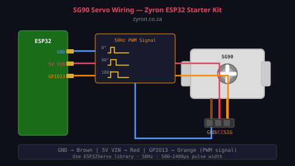

# Lesson 09 — SG90 Servo Motor

> **Zyron ESP32 Starter Kit Course** | [zyron.co.za](https://zyron.co.za)

---

## What Is a Servo Motor?

A **servo motor** is a motor that rotates to a precise, commanded angle. Unlike a regular DC motor (which just spins), a servo has:
- A built-in gearbox (reduces speed, increases torque)
- A built-in position sensor (potentiometer)
- A built-in controller (reads your PWM signal and moves to the commanded angle)

The **SG90** is a micro servo — small, light, cheap, and ideal for small robots, pan/tilt cameras, smart locks, and mechanical actuators.


*SG90 servo with mounting horns — the plastic arm attaches to the output shaft*

---

## Specifications

| Property | Value |
|---|---|
| Operating voltage | 4.8V – 5V |
| Torque | 1.8 kg·cm at 4.8V |
| Speed | 0.1 sec/60° at 4.8V |
| Rotation range | 0° – 180° |
| Weight | ~9 grams |
| Signal frequency | 50 Hz |
| Pulse width | 500 µs (0°) to 2400 µs (180°) |

---

## How PWM Control Works

The servo is controlled by a **PWM (Pulse Width Modulation)** signal at **50 Hz** (one pulse every 20 milliseconds).

The **width of the pulse** tells the servo what angle to go to:

```
  20ms period (50Hz)
  │←──────────────────────────────────────────→│

  0°:
  ┌──┐
  │  │
  ┘  └────────────────────────────────────────
  ↑500µs

  90° (centre):
  ┌──────┐
  │      │
  ┘      └────────────────────────────────────
  ↑1500µs

  180°:
  ┌────────────┐
  │            │
  ┘            └──────────────────────────────
  ↑2400µs
```

The servo motor measures the pulse width and moves its shaft to the corresponding angle. Your position is held as long as pulses continue.

---

## Wiring



```
SG90 Servo          ESP32 DevKit
──────────────────────────────────
  Brown / Black  →   GND
  Red            →   5V (VIN)
  Orange/Yellow  →   GPIO 13 (PWM signal)
```

> **⚠️ Important:** Servos need **5V** to operate reliably. Running from 3.3V causes weak torque and jitter.
>
> For multiple servos or a loaded servo, use a separate 5V supply rather than the ESP32's VIN pin — the USB regulator may not supply enough current for sustained servo movement.

---

## Required Library

Install via **Tools → Manage Libraries:**
- **ESP32Servo** (by Kevin Harrington)

The standard Arduino `Servo.h` does not work correctly on ESP32 — you must use `ESP32Servo`.

---

## Example Code

Open [examples/10_servo_sweep/10_servo_sweep.ino](../../examples/10_servo_sweep/10_servo_sweep.ino)

### Basic angle control

```cpp
#include <ESP32Servo.h>

Servo myServo;

void setup() {
    ESP32PWM::allocateTimer(0);
    myServo.setPeriodHertz(50);           // 50Hz standard servo
    myServo.attach(13, 500, 2400);        // pin, min pulse µs, max pulse µs
}

void loop() {
    myServo.write(0);    // Go to 0°
    delay(1000);
    myServo.write(90);   // Go to 90° (centre)
    delay(1000);
    myServo.write(180);  // Go to 180°
    delay(1000);
}
```

### Smooth sweep

```cpp
// Sweep smoothly from 0° to 180° in 1° steps
void smoothSweep() {
    for (int angle = 0; angle <= 180; angle++) {
        myServo.write(angle);
        delay(15); // 15ms per degree = ~2.7 seconds for full sweep
    }
    for (int angle = 180; angle >= 0; angle--) {
        myServo.write(angle);
        delay(15);
    }
}
```

### Potentiometer control

```cpp
void potControl() {
    int raw   = analogRead(34);           // Read potentiometer (0–4095)
    int angle = map(raw, 0, 4095, 0, 180); // Map to 0–180°
    myServo.write(angle);
    delay(15);
}
```

---

## Servo Jitter Causes

| Cause | Fix |
|---|---|
| Powered from 3.3V | Use 5V (VIN or separate supply) |
| Insufficient current | Use separate 5V 1A+ supply for servos |
| Noisy PWM signal | `ESP32PWM::allocateTimer()` allocates hardware timers — do this first |
| Mechanical load too high | Reduce load or use a stronger servo (MG90S, MG996R) |

---

## Real-World Uses

- **Pan/tilt camera** — two servos for X and Y axis
- **Smart lock** — servo turns a bolt
- **Robot arm** — multiple servos for joints
- **Automated valve** — open/close a water valve
- **RC vehicle steering** — servo steers front wheels
- **Radar scanner** — HC-SR04 mounted on servo for 180° distance scan

---

## Next Lesson

➡️ [Lesson 10 — Buzzer & Button](10_buzzer_button.md)

*[← Back to Course Index](README.md)*
